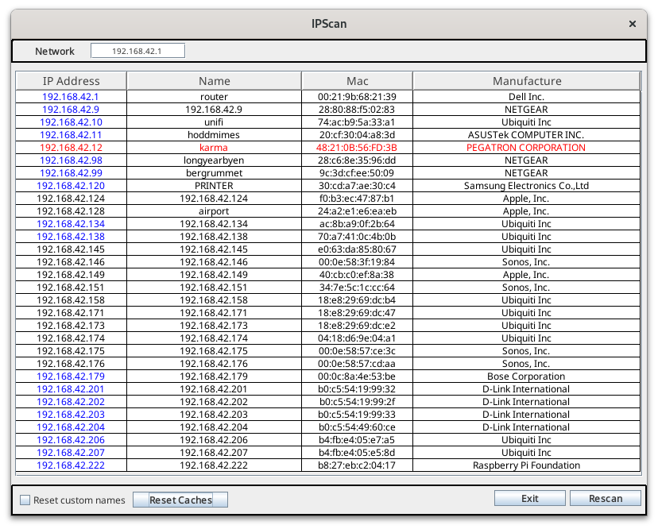

# IPScan

A program for scanning a subnet class C 0-255.
Been tested on Linux and Mac OS



- Blue IP address indicates that the host is running a HTTP server.
- Red IP address indicate this is the current host.


### Mouse Keys

- Double click, open a dialogue allowing the customize the host name.
- MB2, will try to open the default WEB page on the host in the system default WEB browser. This require that the host has aHTTP server running i.e. the host *IP address* is blue coded. 

### How to Run

```
$ java -jar ipscan.1.0.jar
``` 